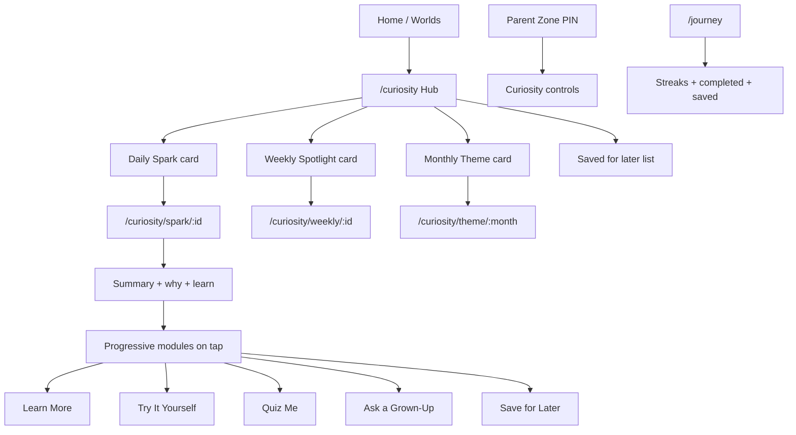

# Curiosity Hub

Kid-safe discovery for daily, weekly, and monthly wonder — **not** a news feed.

## UX flow



1. Child opens **Curiosity Hub** from Home (quick launch or Live Worlds tile).
2. Hub shows up to three surfaced cards (daily / weekly / monthly) based on parent cadence prefs.
3. Tapping a card opens a detail page: **summary first**, deeper sections collapsed (Learn More, Try It, Quiz, Grown-Up, Save).
4. Gentle streak increments when the hub is opened (no push alarms, no guilt copy).
5. Parents configure filters in **Settings → Parent Zone → Curiosity Hub**.

## Content card JSON schema

```json
{
  "id": "spark-2026-03-15-spring-birds",
  "type": "daily|weekly|monthly",
  "title": "kid-friendly title",
  "hook": "one line discovery teaser",
  "ageBands": ["5-7", "8-10", "11-13"],
  "ageContent": {
    "5-7": { "summary": "", "whyItMatters": "", "learn": "" },
    "8-10": { "summary": "", "whyItMatters": "", "learn": "" },
    "11-13": { "summary": "", "whyItMatters": "", "learn": "" }
  },
  "topics": ["science", "seasonal"],
  "region": ["US", "global"],
  "sensitivity": "gentle|standard",
  "visual": { "emoji": "🐦", "gradient": "from-[#a8e6cf] to-[#88d8b0]" },
  "seasons": ["spring"],
  "schoolPeriods": ["in-session"],
  "sportsMoments": ["winter-games-season"],
  "learnMore": [{ "title": "", "body": "" }],
  "tryItYourself": { "title": "", "steps": [] },
  "quiz": [{ "question": "", "options": [], "answer": "", "explanation": "" }],
  "askGrownUp": ["prompt"],
  "timeline": [{ "year": "", "label": "", "detail": "" }],
  "map": { "title": "", "regions": [{ "name": "", "note": "" }] },
  "sportsBracket": { "title": "", "rounds": [{ "label": "", "matchups": [] }] },
  "activeFrom": "YYYY-MM-DD",
  "activeUntil": "YYYY-MM-DD",
  "priority": 0,
  "rawNews": false,
  "autoplay": false
}
```

**Safety fields (enforced in code):** `rawNews` and `autoplay` must not be true; titles/hooks are scanned for blocked patterns; no live news APIs.

## Topic selection rules

| Signal | Source | Use |
|--------|--------|-----|
| Calendar date | `activeFrom` / `activeUntil` | Hard window |
| Season | Month → spring/summer/fall/winter | Score boost |
| US school period | Rule table in `calendar.js` | Score boost |
| Sports moment | Month-based themes (Olympics season, etc.) | Score boost |
| Daily seed | `YYYY-MM-DD-region-ageGroup` | Stable pick among top-scored dailies |
| Weekly seed | ISO week key | Stable weekly spotlight |
| Monthly seed | `YYYY-M-region-ageGroup` | Monthly theme |

Selection: filter → score by context → `hashPick(seed, topCandidates)`.

## Age-based content rules

| KidQuest age group | Curiosity band |
|--------------------|----------------|
| Explorer (4–6) | 5–7 |
| Adventurer (7–10) | 8–10 |
| Champion (11–13) | 11–13 |

Cards list `ageBands` they support. Copy comes from `ageContent[band]`. Cards outside the band are hidden.

## Parent control spec

Location: **Settings → Parent Zone (PIN) → Curiosity Hub**

| Control | Storage key | Default |
|---------|-------------|---------|
| Region | `region` | `US` |
| Max sensitivity | `maxSensitivity` | `standard` |
| Topic toggles | `topics.*` | all on |
| Show daily / weekly / monthly | `showDaily` etc. | true |
| Require approval for standard topics | `requireTopicApproval` | false |
| Approved topic IDs | `approvedTopicIds` | `[]` |

Gentle cards always show. Standard cards require approval when `requireTopicApproval` is enabled.

## Routes

- `/curiosity` — hub
- `/curiosity/spark/:id` — daily detail
- `/curiosity/weekly/:id` — weekly detail
- `/curiosity/theme/:month` — monthly theme (`YYYY-MM`)

## Sample card IDs (fully populated modules)

1. `spark-2026-03-15-spring-birds` — science / seasonal  
2. `weekly-2026-02-olympics-spirit` — sports / culture (+ bracket)  
3. `spark-2026-06-space-movie-wonder` — movie / science (+ timeline)  
4. `monthly-2026-03-spring-science` — seasonal / science (+ map)  
