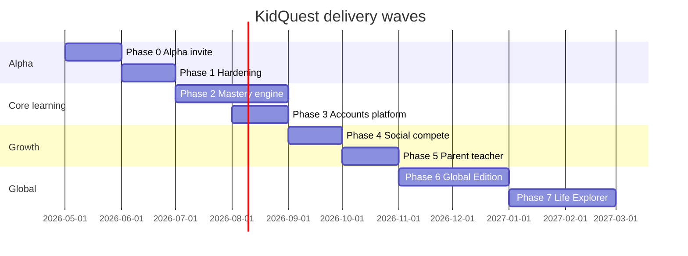

# KidQuest — Product Roadmap

**Vision:** A kids-first **learning community** for ages **4–13** (optional **Teen** mode to 18) — curiosity, parent co-learning, vetted crowdsourced missions, and safe competition. Full product spec: **[PRD.md](./PRD.md)** · Safety: **[MODERATION.md](./MODERATION.md)**.

**Current version:** `0.2.0-alpha.1`  
**Last updated:** May 2026  
**Phases 0–7:** Foundational v1 shipped in app — see routes `/life`, `/compete/daily-duel`, `/compete/friends`, `/compete/geography-sprint`. Run `npm run db:apply` after pull for new tables.
**Status key:** ✅ Done · 🟡 In progress · ⬜ Planned

**Alpha QA:** [ALPHA_QA.md](./ALPHA_QA.md)

---

## Alpha scope (0.2.0-alpha.1)

Ship feedback-ready **without accounts required** (local progress; cloud optional).

| Priority | Alpha deliverable | Status |
|----------|-------------------|--------|
| **1 Geography** | 5-track hub, map-locate quiz, Learn browse/map, 194-country data | ✅ |
| **2 Solar System** | Lessons + Learn (planets, scale, missions) | ✅ |
| **3 Mastery v0** | Lesson stars, geo track bars, SM-2 subset, Review hub | ✅ |
| **Math support** | Multiplication camp + Math Learn | ✅ |
| **Out of alpha** | Full 195-country SRS, social, Life Explorer UGC, Stripe, teen mode | Roadmap below |

**Post-alpha (your 7 priorities):** Full mastery engine → Social → Parent/Teacher → Accounts/beta → Global i18n/PWA → Life Explorer (Phase 9+). See [PRD.md](./PRD.md).

---

## Product pillars

| Pillar | What success looks like |
|--------|-------------------------|
| **Learn** | Every subject follows a clear 5-phase mastery path (Learn → Practice → Speed → Boss → Legend). |
| **Explore** | Geography and Solar feel like discovery, not worksheets — maps, scale, stories. |
| **Create** | Kids express learning (journals, stories, projects) with light structure. |
| **Compete** | Fair, authenticated leaderboards and challenges that motivate without toxicity. |
| **Trust** | COPPA-aware auth, parent PIN, classroom isolation, moderated UGC, no dark patterns. |
| **Community** | Parents/teachers submit ideas; mods publish; kids never see raw UGC. |
| **Impact** | Freemium + subscriptions that can fund seats for underserved learners. |

---

## What is shipped today

### Platform & deployment

| Feature | Status |
|---------|--------|
| React + Vite SPA, Tailwind, Framer Motion, Zustand | ✅ |
| Vercel deploy + Docker/Nginx image | ✅ |
| GitHub repo + env-based Supabase/Vercel config | ✅ |
| Automated DB schema apply (`npm run db:apply`) | ✅ |
| GitHub Action for schema on `main` | ✅ |
| Error boundary + session exit guards (timed modes) | ✅ |

### Auth & cloud (Supabase)

| Feature | Status |
|---------|--------|
| Landing / Register / Login (email + password) | ✅ |
| Roles at signup: Kid, Parent, Teacher | ✅ |
| Profiles + user_stats tables + RLS | ✅ |
| Lesson progress cloud sync (debounced upsert) | ✅ |
| Multiplication table + fact progress sync | ✅ |
| Speed-run leaderboard with `user_id` + deduped view | ✅ |
| Classrooms (create/join codes) + assignments + digests | ✅ |
| Parent/Teacher dashboard (PIN) with cloud when signed in | ✅ |
| Google OAuth (Supabase) | ✅ See [GOOGLE_AUTH.md](./GOOGLE_AUTH.md) |
| Facebook OAuth | ⬜ |

### Kid experience (UX)

| Feature | Status |
|---------|--------|
| 5-tab nav: Learn · Explore · Create · Compete · Me | ✅ |
| Dark game-style top bar + streak strip | ✅ |
| Dashboard: review card, speed-run CTA, subject grid | ✅ |
| Onboarding: name, age group, avatar builder | ✅ |
| Monthly themes, About, Impact pages | ✅ |

### Core subjects (lesson JSON + quiz engine)

| Subject | Lessons / content | Learn surface | Map / special |
|---------|-------------------|---------------|---------------|
| History | ✅ JSON | ✅ Generic learn + lessons | — |
| Geography | ✅ 194 countries | ✅ Map browse + country detail | ✅ Map-locate quiz |
| Music | ✅ JSON | ✅ Generic learn + lessons | — |
| Math (lessons) | ✅ JSON | ✅ Math learn hub | — |
| General Knowledge | ✅ JSON | ✅ Generic learn + lessons | — |
| Trivia | ✅ JSON | ✅ Generic learn + lessons | — |
| Solar System (bonus) | ✅ Structured content | ✅ Planets, scale, missions | — |

### Multiplication Mastery Module (1×–20×)

| Feature | Status |
|---------|--------|
| 400 facts, tables 1–20, unlock progression | ✅ |
| Phase 1 Learn (dot arrays, patterns) | ✅ |
| Phase 2 Practice (multiple choice) | ✅ |
| Phase 3 Speed Drill (typed, &lt;3s target) | ✅ |
| Phase 4 Boss Battle (20 mixed, timer) | ✅ |
| Phase 5 Legend (SRS sessions) | ✅ |
| SM-2 spaced repetition reviews | ✅ |
| 50-question global speed run + medals | ✅ |
| Shareable result card (Canvas + Web Share) | ✅ |
| Personal best chart | ✅ |
| Table badges + Grand Multiplier rank | ✅ |
| Web Audio SFX pack | ✅ |
| Life Explorer (map, journals, stories) | ✅ v1 |
| i18n (EN + ES), PWA shell, Tesla mode | ✅ v1 |
| Friends + Daily Duel + subject leaderboards | ✅ v1 |

### Parent / teacher (essentials)

| Feature | Status |
|---------|--------|
| PIN-protected Settings | ✅ |
| Daily goal, age group, sound toggles | ✅ |
| Time per subject, progress reset | ✅ |
| Teacher assignments (templates + CRUD) | ✅ cloud + local fallback |
| Classrooms + join codes | ✅ |
| Parent digest log + CSV export | ✅ |
| Weekly email digest | ⬜ |
| PDF progress reports | ⬜ |

---

## Phase 0 — Initial alpha (now)

**Goal:** Invite-first cohort can register, learn, sync progress, and use Math + Geography + Solar without blocker bugs.

| # | Deliverable | Status | Notes |
|---|-------------|--------|-------|
| 0.1 | Stable deploy on Vercel with Supabase env | ✅ | |
| 0.2 | `npm run db:apply` documented + CI | ✅ | |
| 0.3 | Auth gate when Supabase configured | ✅ | Falls back to local if env missing |
| 0.4 | Full multiplication 1→Legend path QA | 🟡 | Hooks/exit guards fixed; needs device QA |
| 0.5 | Geography map-locate + learn QA | 🟡 | Core works; difficulty tuning open |
| 0.6 | Solar learn surface QA | 🟡 | |
| 0.7 | All 5 tabs non-placeholder minimum | 🟡 | Explore/Create/Compete are starter hubs |
| 0.8 | Smoke test checklist in repo | ⬜ | Manual + optional Playwright later |
| 0.9 | Rotate exposed DB password + GitHub secrets | ⬜ | Security hygiene |

**Alpha exit criteria**

- [ ] New user: register → onboard → complete 1 lesson + 1 multiplication table phase → see data in Supabase
- [ ] Speed run appears on leaderboard when authenticated
- [ ] Parent can create classroom + assignment; kid sees assignment when linked
- [ ] No P0 crashes on iOS Safari + Chrome Android (smoke)

---

## Phase 1 — Alpha hardening (2–3 weeks)

**Goal:** Polish, reliability, and coaching UX so retention improves in the first session.

### Learning UX

| # | Feature | Priority |
|---|---------|----------|
| 1.1 | Session-end summaries (Learn/Practice/Drill/Boss) | P0 |
| 1.2 | Persistent progress on every practice screen | P0 |
| 1.3 | Coaching copy audit (no harsh “wrong”) | P0 |
| 1.4 | Touch targets ≥48px; keypad keys ≥72px | P0 |
| 1.5 | “Next best action” copy on dashboard cards | P1 |
| 1.6 | Route-level error boundaries | P1 |

### Multiplication polish

| # | Feature | Priority |
|---|---------|----------|
| 1.7 | Howler SFX: correct, wrong, level-up, boss, speed-run | P1 |
| 1.8 | Full SR persistence model review (cloud merge rules) | P1 |
| 1.9 | Speed-run anti-cheat: min time per question heuristic | P2 |
| 1.10 | Subject-specific speed challenges (Geo/Solar) scoring | P2 |

### Platform

| # | Feature | Priority |
|---|---------|----------|
| 1.11 | Email confirmation flow UX (if enabled in Supabase) | P1 |
| 1.12 | Password reset page | P1 |
| 1.13 | Offline banner when Supabase unreachable | P2 |
| 1.14 | E2E smoke tests (Playwright): auth, home, one lesson | P2 |

---

## Phase 2 — Mastery engine across subjects (4–6 weeks)

**Goal:** Geography, Solar, and lesson-based subjects share the same 5-phase mental model as multiplication.

### Geography depth

| # | Feature | Description |
|---|---------|-------------|
| 2.1 | Per-country mastery tracks | Introduce → Practice → Review → Master → Legend |
| 2.2 | SM-2 on country facts (capital, flag, region) | Shared algorithm with multiplication |
| 2.3 | Continent progression | Home continent first, then unlock world |
| 2.4 | Champion map feedback | Hot/cold hints, distance on wrong pin |
| 2.5 | World Map of Knowledge on Profile | Visual mastery map |
| 2.6 | Geography speed sprint mode | 8 map-locate questions, timed |

### Solar System depth

| # | Feature | Description |
|---|---------|-------------|
| 2.7 | Structured lesson progression | Not only browse — gated phases |
| 2.8 | Planet fact SRS | Orbit, moons, size comparisons |
| 2.9 | Mission timeline assessments | Quiz gates between sections |
| 2.10 | Solar boss battle | Mixed planet facts under time pressure |

### History, Music, GK, Trivia

| # | Feature | Description |
|---|---------|-------------|
| 2.11 | Learn surfaces for remaining subjects | Match Geography/Solar pattern |
| 2.12 | Content expansion | 10+ lessons per subject per age band (stretch) |
| 2.13 | Cross-subject “daily challenge” | One mixed quiz per day |

### Unified progression UI

| # | Feature | Description |
|---|---------|-------------|
| 2.14 | Global phase labels on all subject cards | Learn / Practice / Speed / Boss / Legend |
| 2.15 | Unified `/review` hub | All due SRS items across subjects |
| 2.16 | Subject rank titles on Profile | Already partial — extend to all |

---

## Phase 3 — Accounts & data platform (3–4 weeks)

**Goal:** Production-grade identity, multi-device sync, and data integrity.

| # | Feature | Description |
|---|---------|-------------|
| 3.1 | Google OAuth (Supabase) | Replace disabled button |
| 3.2 | Apple Sign-In (optional, iOS families) | P2 |
| 3.3 | COPPA parent consent flow | Under-13: parent email verify before social features |
| 3.4 | Multi-child profiles per parent account | Switch kid without new email |
| 3.5 | Contributor role + moderation queue | User-submitted content pipeline |
| 3.6 | Server-side rate limits | Speed-run submit, assignment spam |
| 3.7 | Realtime sync (Supabase Realtime) | Optional live leaderboard updates |
| 3.8 | Data export API | GDPR-style full export |
| 3.9 | Admin dashboard (internal) | User lookup, ban, content flags |

---

## Phase 4 — Social & competition (4–5 weeks)

**Goal:** Motivate through fair play — friends, classrooms, and global boards.

| # | Feature | Description |
|---|---------|-------------|
| 4.1 | Friend system | Username search or QR invite |
| 4.2 | Daily Duel | Same 10 questions, async compare |
| 4.3 | Subject Showdown | Weekly themed leaderboard |
| 4.4 | Team Quests | Classroom cooperative goals |
| 4.5 | Leaderboard filters | Global · Age group · Classroom (partial today) |
| 4.6 | Subject leaderboards (real data) | Replace mock peers in Compete hub |
| 4.7 | Shareable rank cards | Image cards for social (beyond speed run) |
| 4.8 | Printable certificates | PDF per subject Legend |
| 4.9 | Anti-toxicity | No open chat; preset emotes only |

---

## Phase 5 — Parent & teacher platform (3–4 weeks)

**Goal:** Adults run classes and families with confidence — not just PIN settings.

### Parent dashboard

| # | Feature | Description |
|---|---------|-------------|
| 5.1 | Weekly email digest | Automated from `parent_digests` + stats |
| 5.2 | Weak-area highlights | Tables/countries below threshold |
| 5.3 | Screen-time caps | Optional daily minutes |
| 5.4 | Multi-kid comparison view | Sibling progress side-by-side |
| 5.5 | Goal setting per subject | “5 geography lessons this week” |

### Teacher dashboard

| # | Feature | Description |
|---|---------|-------------|
| 5.6 | Class roster management | Invite links, remove students |
| 5.7 | Assignment templates library | Curated by grade |
| 5.8 | Assignment completion tracking | Per-student, per-assignment |
| 5.9 | Class progress heatmap | Tables × students |
| 5.10 | PDF / CSV class export | Gradebook-friendly |
| 5.11 | Standards alignment tags | Common Core / local curriculum hooks |

---

## Phase 6 — Global Edition (6–8 weeks)

**Goal:** KidQuest works worldwide — languages, offline, accessibility, low bandwidth.

| # | Feature | Description |
|---|---------|-------------|
| 6.1 | `react-i18next` framework | EN ship first |
| 6.2 | Language packs | ES, FR, HI, PT, AR (+ RTL layout) |
| 6.3 | Locale-aware number/date formatting | |
| 6.4 | PWA manifest + install prompt | Add to home screen |
| 6.5 | Service worker | Cache shell + critical routes |
| 6.6 | IndexedDB offline progress queue | Sync when back online |
| 6.7 | Offline geography track | Download continent pack |
| 6.8 | Tesla / kiosk mode | `?tesla=true` large UI |
| 6.9 | Low-bandwidth mode | Reduced imagery, lazy maps |
| 6.10 | WCAG AA audit | Focus order, contrast, screen reader |
| 6.11 | Dyslexia-friendly font toggle | OpenDyslexic or similar |
| 6.12 | Web Speech API TTS | Explorer age group read-aloud |

---

## Phase 7 — Life Explorer & Create (6–10 weeks)

**Goal:** Kids document their world — places, books, movies, stories — inside KidQuest.

| # | Feature | Description |
|---|---------|-------------|
| 7.1 | Personal world map | Pins: visited, dream, home |
| 7.2 | Reading journal | Open Library integration |
| 7.3 | Movie journal | TMDB metadata |
| 7.4 | Music journal | MusicBrainz or simplified |
| 7.5 | Story editor | Rich text + illustrations |
| 7.6 | Book builder | Multi-page export |
| 7.7 | PDF export of projects | |
| 7.8 | AI story starter | Optional Claude API, parent-gated |
| 7.9 | “My KidQuest site” | Private / link / class share |
| 7.10 | Create hub → full module | Replace starter prompts |

---

## Phase 8 — Community & contributions (PRD §6.3, §8)

| # | Feature | Description |
|---|---------|-------------|
| 8.1 | Ideas Board | Kids submit **templates only** (internal signal; not public) |
| 8.2 | Contributor portal | Parents/teachers submit missions → `ugc_submissions` |
| 8.3 | Moderation admin UI | Queue, approve/reject, audit log ([MODERATION.md](./MODERATION.md)) |
| 8.4 | Published `missions` table | Curated + approved packs in app |
| 8.5 | Vote/remix (adults) | Community refinement on approved candidates |
| 8.6 | Contributor credits | Profile badge + About page |
| 8.7 | Impact live counters | Learners, countries, hours (anonymous aggregate) |

---

## Phase 9 — Monetization & impact (PRD §10)

| # | Feature | Description |
|---|---------|-------------|
| 9.1 | KidQuest Plus (family) | Premium tracks, multi-kid, advanced parent dashboard |
| 9.2 | **1:1 give-back seats** | Paid sub funds scholarship seat(s) |
| 9.3 | Sponsored mission packs | Vetted brand-funded collections |
| 9.4 | KidQuest Classroom (schools) | Bulk seats, SSO |
| 9.5 | Stripe billing + COPPA review | Family subscription compliance |
| 9.6 | Native apps | Capacitor or RN wrapper |

## Phase 10 — Teen mode & life skills (PRD §4, §6.1)

| # | Feature | Description |
|---|---------|-------------|
| 10.1 | Teen Explorer UI (13–18 opt-in) | Less childish chrome, deeper copy |
| 10.2 | Life-skills mission library | Money, cooking, empathy, AI literacy, civic, safety, careers |
| 10.3 | Family goals | Parent-set monthly goals + progress |
| 10.4 | Discussion cards | Post-mission parent prompts (Amazon Kids–style) |
| 10.5 | Constellations / NASA polish | Advanced astronomy (stretch) |
| 10.6 | AI story starter | Parent-gated, optional API |

---

## Recommended delivery timeline (summary)

---

## How to use this roadmap

- **Product vision & MVP scope:** see [`PRD.md`](./PRD.md)  
- **Moderation & COPPA posture:** see [`MODERATION.md`](./MODERATION.md)  
- **Tactical week-to-week tasks:** see [`ALPHA_TODO.md`](./ALPHA_TODO.md)  
- **UX rules and layout:** see [`UX_REDESIGN_V1.md`](./UX_REDESIGN_V1.md)  
- **Setup and deploy:** see [`../README.md`](../README.md)

When a feature ships, move it to **What is shipped today** and mark the phase item ✅ in this file.

---

## Success metrics (by phase)

| Phase | Metric |
|-------|--------|
| Alpha | Registration completion rate, D1 return, 0 P0 bugs in first 50 users |
| Hardening | Avg session length, multiplication phase-2 completion rate |
| Mastery engine | % countries mastered per active user, review session completion |
| Social | Friend invites sent, duel participation rate |
| Parent/Teacher | % teachers creating ≥1 assignment, parent weekly digest open rate |
| Global | % sessions from non-EN locales, offline lesson completions |
| Life Explorer | Create tab DAU / MAU ratio |

---

*Designed by Vinay · Built with Cursor · Knowledge is free.*
